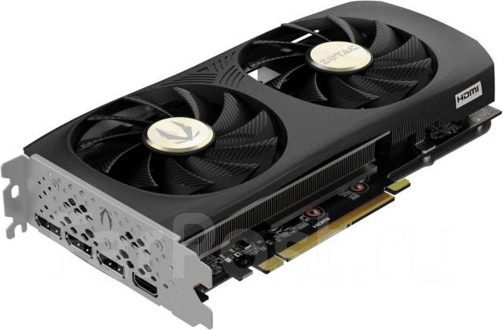
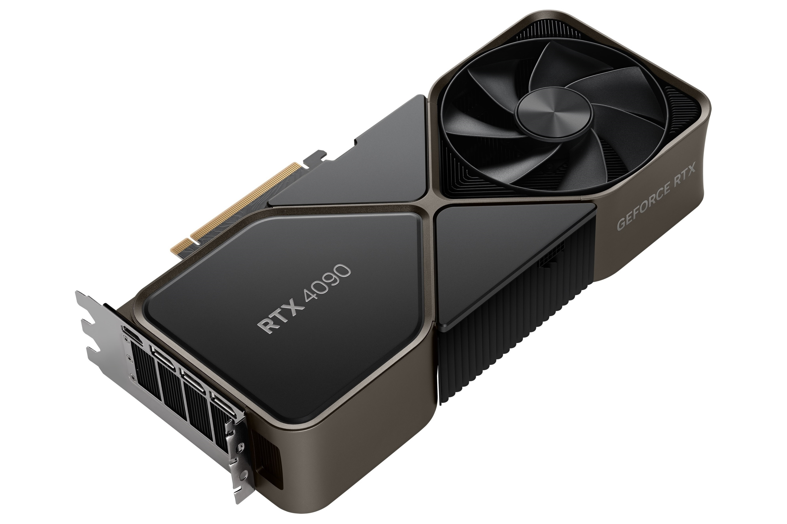
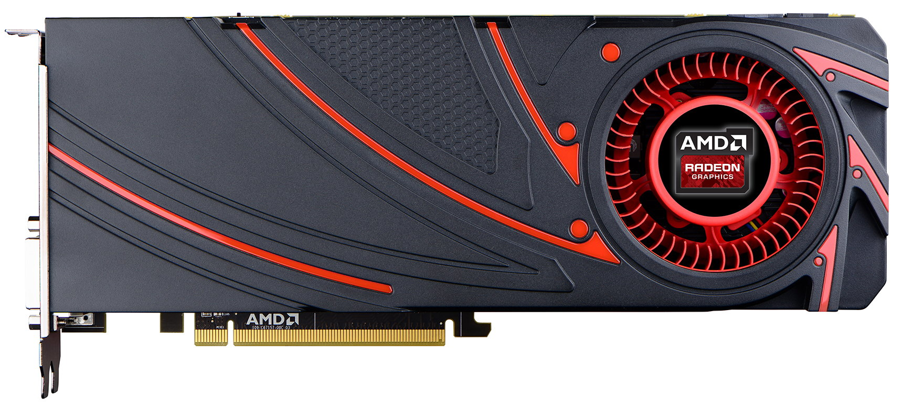

# 📋 Что такое видеокарта?
## Видеокарта (или графический процессор, GPU) — это специализированное аппаратное устройство в компьютере, предназначенное для обработки и вывода изображений на экран. Она отвечает за рендеринг графики: от простых элементов интерфейса до сложных трёхмерных сцен в играх и приложениях.

## ✨ Популярные видеокарты на данный момент
### На данный момент рынок видеокарт занимают две компании:
### - NVIDIA

### - AMD

## 🚀 Nvidia
### Nvidia - крупная компания, занимающая большую часть рынка видеокарт по всему миру, имеет большое количество линеек.
### NVIDIA была основана в апреле 1993 года тремя инженерами — *Дженсеном Хуангом* (Jensen Huang), *Крисом Малаховски* (Chris Malachowsky) и *Кертисом Приемом*(Curtis Priem). Дженсен Хуанг стал президентом и генеральным директором компании и сохраняет эту позицию по сей день.
## Плюсы и минусы видеокарт Nvidia:
 - [x] Мощность
 - [x] Соотношение цена/качество
 - [x] Уникальные технологии (DLSS, FG, G-Sync)
 - [ ] Цена
 - [ ] Драйвера на ОС Линукс

## 🚀 AMD
### АМД - так же является крупной компанией, занимающей остальную часть рынка видеокарт.
### Компания AMD была основана 1 мая 1969 года *Джерри Сандерсом* (Jerry Sanders) и группой соучредителей. Штаб-квартира изначально располагалась в Санта-Кларе, Калифорния, США.
## Плюсы и минусы видеокарт АМД:
 - [x] Мощность
 - [x] Соотношение цена/качество
 - [x] Уникальные технологии (FSR, FG)
 - [x] Свободное использование технологий
 - [ ] Драйвера

## Какие видеокарты выбрать - AMD или Нвидиа?
### Ответ на этот вопрос может быть озвучен с двух сторон. Если вам нужно просто поиграть, адекватным выбором будет купить Нвидиа, но с другой стороны - АМД имеет свободные технологии, тоесть их технологиями по типу ФСР могут пользоваться и геймеры с видеокартами НВИДИА, так что хороший выбор - АМД.
### Так же видеокарты нвидиа плохо сочетаются с операционными системами Линукс, и как говорил Линус Торвальдс - Нвидиа - фак ю!!!
